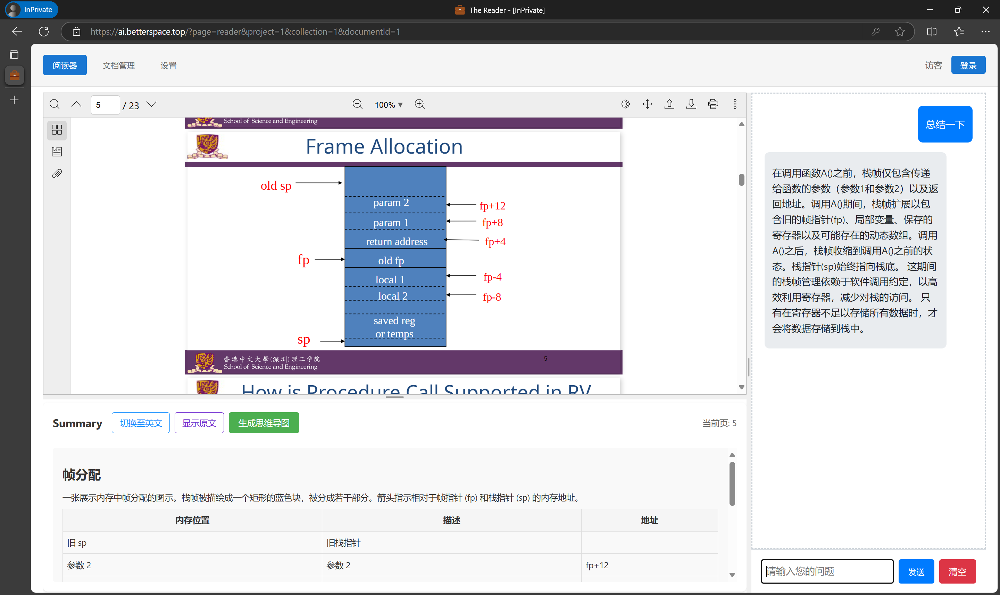
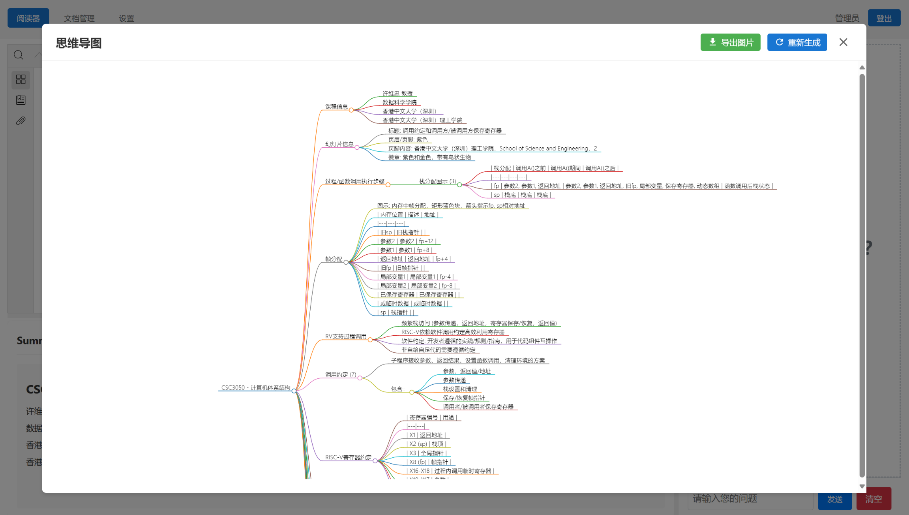
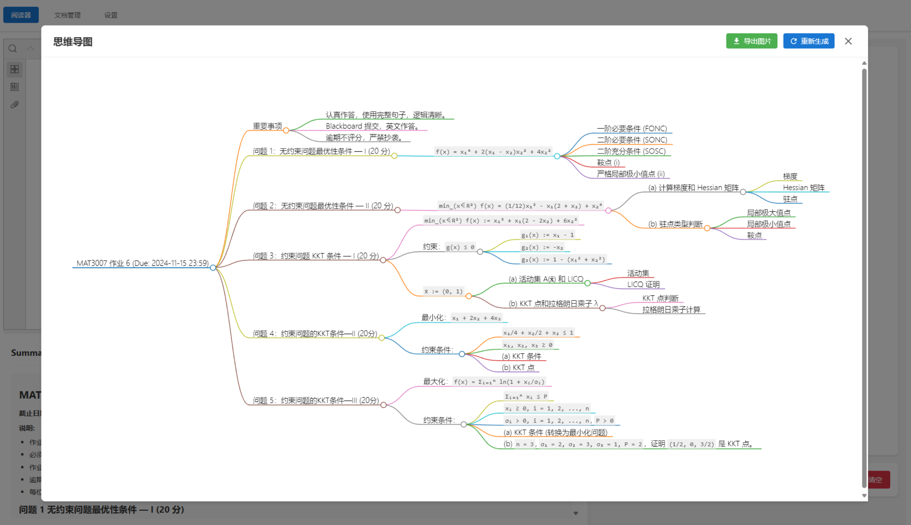
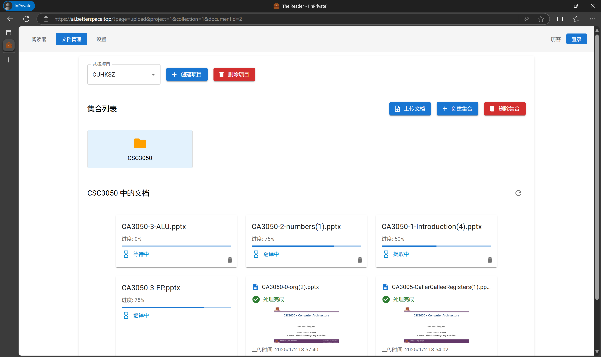
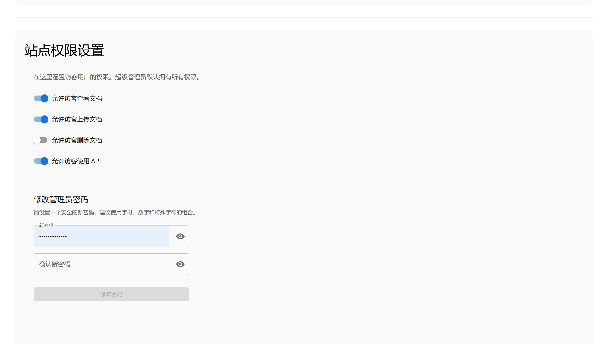
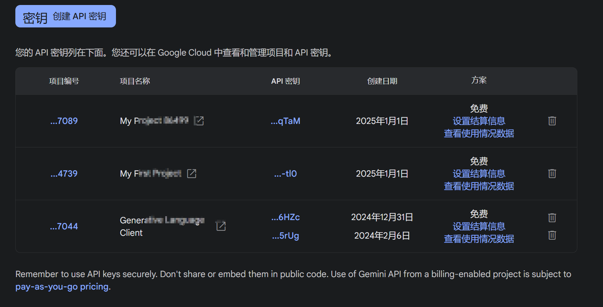

# 💼 The Reader

The Reader 是一个基于 Django 和 React 的智能文档处理系统，能够自动处理、翻译和管理各种文档。

## ✨ 功能特性

- 📄 支持多种文档格式（PDF、DOCX、PPTX）
- 🔄 自动文档处理流水线
  - 🛠️ 文档预处理和转换
  - 🔍 智能文本提取
  - 🌐 中英文翻译
- 📁 项目和集合管理
- 👥 用户权限控制
- 🔎 文档在线预览
- 📱 响应式界面设计

### 📚 文档阅读



支持文档在线阅读，支持文档翻译，支持文档翻译后实时提问AI。

#### 🗺 总结思维导图





快速总结文档内容，生成思维导图。

### 📁 文档管理



支持文档批量上传，支持文件目录管理。

### 🔒 权限控制



支持控制访客权限。

默认管理员密码为空，直接回车即可登录。登陆后请注意修改密码。

## 🏗️ 技术架构

### 🔧 后端 (Django)

- ⚡ 文档处理流水线 (`DocumentPipeline`)
  - 多线程任务处理
  - 状态追踪和错误处理
- 🌐 RESTful API
- 🔒 权限管理系统
- 🤖 Gemini API 集成
  - API Pool 管理，自动轮换API Key

### 🎨 前端 (React)

- 现代化 UI 组件
- 实时任务状态更新
- 文档预览功能
- 项目和集合管理界面

## 💻 系统要求

- Python 3.11+
- Node.js 18+
- LibreOffice (用于文档转换)
- SQLite

## 🚀 快速开始

1. 📦 拉取Docker镜像

```bash
docker pull ghcr.io/betterandbetterii/the-reader:latest
```

2. 🎯 使用docker-compose启动

（仅启动后端Django服务器）
```bash
docker-compose up -d
```

然后访问 `http://localhost:8000/`

（启动后端Django服务器和Nginx服务器，docker-compose-nginx.yml）
```bash
docker-compose -f docker-compose-nginx.yml up -d
```

然后访问 `http://localhost/`

## 📂 项目结构

```
TheReader/
├── backend/          # Django 后端配置
├── api/             # API 视图和模型
├── pipeline/        # 文档处理流水线
├── clients/         # API 客户端
├── prepdocs/       # 文档预处理模块
├── frontend/        # React 前端应用
│   ├── src/
│   │   ├── components/  # React 组件
│   │   ├── pages/      # 页面组件
│   │   └── App.js      # 主应用
└── nginx/           # Nginx 配置
```

## 🔑 API 密钥配置

系统需要配置 Gemini API 密钥才能正常运行：

1. 🔧 在管理界面添加 API 密钥
2. ⚙️ 配置 API 基础 URL（默认为 https://api.betterspace.top）

### Gemini免费密钥申请

在谷歌ai控制台创建一个apikey：https://aistudio.google.com/app/apikey

一个账号最多可以开通11个免费项目，每个项目的限额是独立的，可以用来个人使用。



创建API后，可以检查是否处于免费状态

如果处于付费层，修改控制台的费用账号绑定。把结算账号置空即可。

只要确保 https://console.cloud.google.com/billing/projects 这里的结算账号为空就行。

## 📜 许可证

[MIT](LICENSE)
